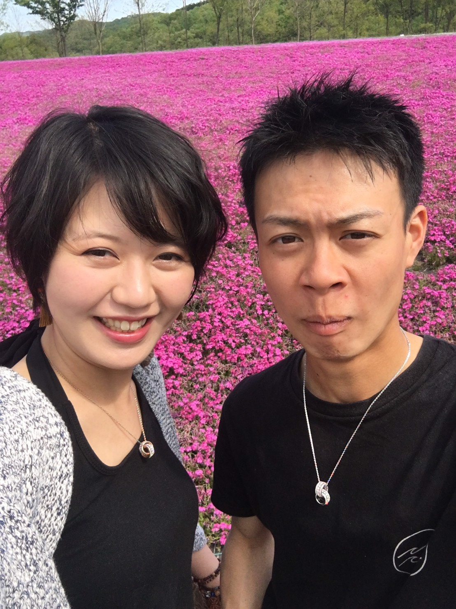
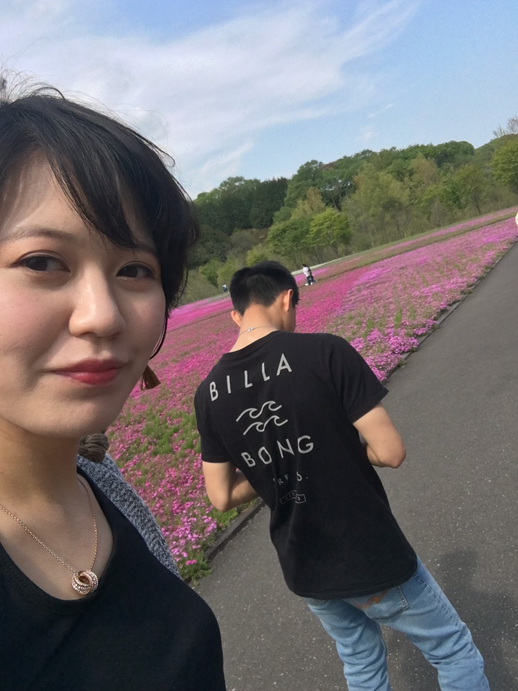
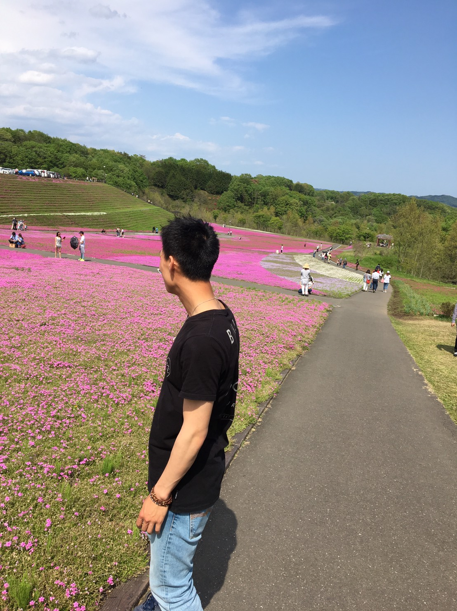
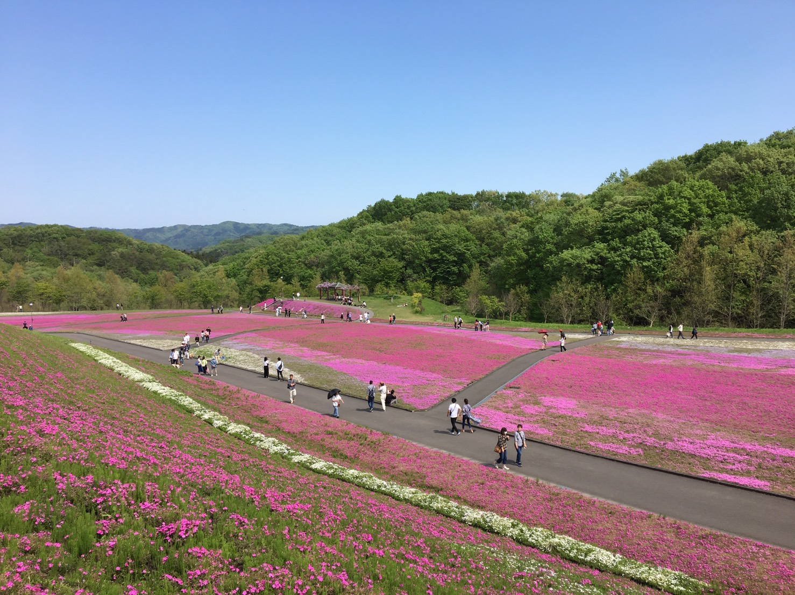
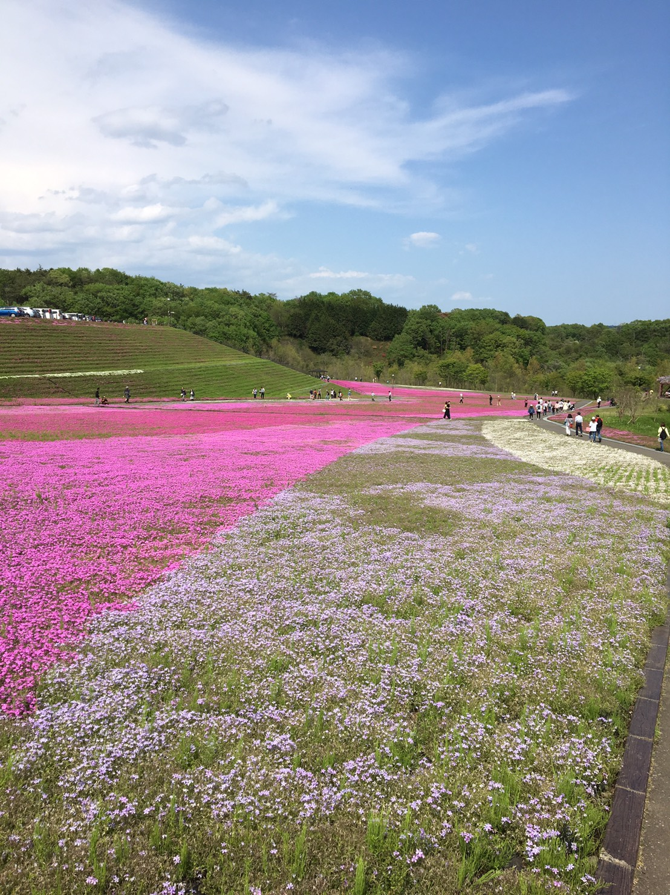

# cautious-barnacle
<html>
<head>
  <meta charset="UTF-8">

</head>
<body>

<h1><marquee behavior="alternate">hello world ! </marquee></h1>

こんにちは、<a href="#0.1_">明日香</a>です。
 
<figure>
  
<figure>
  
</figure>

<h3><marquee behavior="alternate">↑ takeshi-kano-icsさんの画像お借りしました！勝手に借りてごめんなさいm(_ _)m ↑</marquee></h3>

<figure>
  <a href="https://plus.google.com/u/0/photos/photo/107233626263340969070/6547267090878852370?sqid=110457794618962540880&ssid=fcbc648f-5a07-4787-8161-bfd8b923ecfc">ネモフィラ</a>
</figure>
 
<figure>
  <a href="https://plus.google.com/u/0/+torokoidMibu/posts/XGE9FYETsnd">ネモフィラ_2</a>
</figure>
 

 

 

<h1><marquee behavior="alternate">  mahoroba → <a href="https://torokoid.github.io/mahoroba/">リンク先</a> </marquee></h1>

<body class="mod-body">

        <?php
            echo "Hi, I'm a PHP script!";
        ?>

</body>
